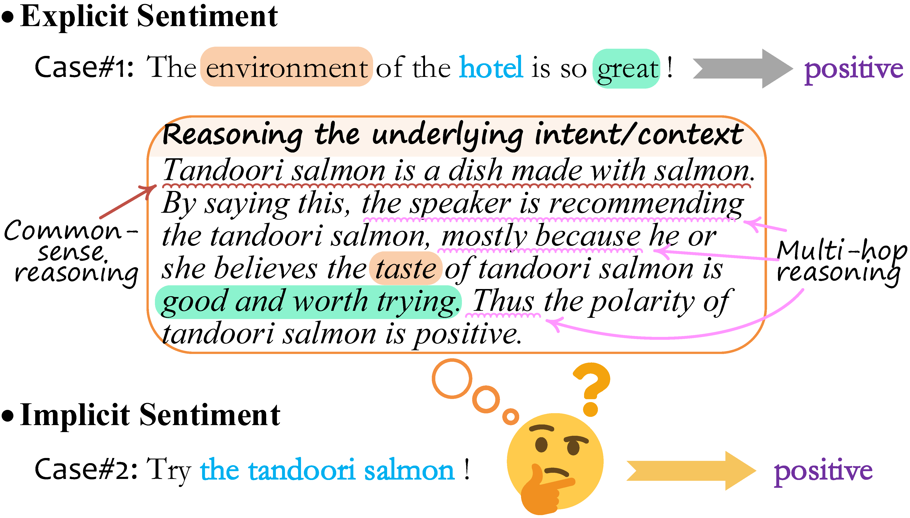

## 🧛🏼‍♀️⚡⚒️ THOR: Three-hop Reasoning for Implicit Sentiment
<a href="https://github.com/scofield7419/THOR-ISA">
  
</a>
<a href="https://github.com/scofield7419/THOR-ISA" rel="nofollow">
  
</a>
<a href="https://huggingface.co/docs/transformers/model_doc/flan-t5" rel="nofollow">
  
</a>
<a href="https://huggingface.co/docs/transformers/index" rel="nofollow">
  
</a>
<a href="https://pytorch.org" rel="nofollow">
  
</a>


**The pytroch implementation of the ACL23 paper [Reasoning Implicit Sentiment with Chain-of-Thought Prompting](https://arxiv.org/abs/2305.11255)**

----------
 ### 🎉 Visit the project page: [THOR-ISA](http://haofei.vip/THOR/)

----------


## Quick Links
- [Overview](#overview)
- [Code Usage](#code)
  - [Requirement](#requirement)
  - [Dataset](#data)
  - [LLMs](#llm)
  - [Run with Flan-T5](#runt5)
  - [Run with GPT-3.5](#GPT)
  - [Suggestions](#suggest)
- [MISC](#misc)


----------

## Overview<a name="overview" />

> While sentiment analysis systems try to determine the sentiment polarities of given targets based on the key opinion expressions in input texts, 
in implicit sentiment analysis (ISA) the opinion cues come in an implicit and obscure manner.

<p align="center">
  
</p>


> Thus detecting implicit sentiment requires the common-sense and multi-hop reasoning ability to infer the latent intent of opinion.
Inspired by the recent chain-of-thought (CoT) idea, in this work we introduce a *Three-hop Reasoning* (**THOR**) CoT framework to mimic the human-like reasoning process for ISA.
We design a three-step prompting principle for THOR to step-by-step induce the implicit aspect, opinion, and finally the sentiment polarity.

<p align="center">
  
</p>


----------


----------

## Code Usage<a name="code" />


----------
### Requirement<a name="requirement" />

``` bash 
conda create -n thor python=3.8
```

``` bash
# CUDA 10.2
conda install pytorch==1.10.0 torchvision==0.11.0 torchaudio==0.10.0 cudatoolkit=10.2 -c pytorch

# CUDA 11.3
conda install pytorch==1.10.0 torchvision==0.11.0 torchaudio==0.10.0 cudatoolkit=11.3 -c pytorch -c conda-forge
```

```bash
pip install -r requirements.txt
```

----------

### Dataset<a name="data" />

SemEval14 Laptop ([laptops](data%2Flaptops)) and Restaurant ([restaurants](data%2Frestaurants)), with fine-grained target-level annotations.


----------
### LLMs<a name="llm" />

A. Use the Flan-T5 as the backbone LLM reasoner:
  - [google/flan-t5-base](https://huggingface.co/google/flan-t5-base),  
  - [google/flan-t5-large](https://huggingface.co/google/flan-t5-large), 
  - [google/flan-t5-xl](https://huggingface.co/google/flan-t5-xl),  
  - [google/flan-t5-xxl](https://huggingface.co/google/flan-t5-xxl),  

B. Evaluate with OpenAI [GPT-3.5](https://platform.openai.com/docs/models/gpt-3-5)

----------
### Training and Evaluating with Flan-T5<a name="runt5" />

Use the [main.py](main.py) script with command-line arguments to run the Flan-T5-based THOR system. 


```bash
python main.py -c <cuda_index> -r [thor|prompt] -d [restaurants|laptops] -z [True|False] -f <config_file>
```
Some important arguments:

- `-c`, `--cuda_index`: Index of the GPU to use for computation (default is 0).
- `-d`, `--data_name`: Name of the dataset. Choices are 'restaurants' or 'laptops' (default is 'laptops').
- `-r`, `--reasoning`: Specifies the reasoning mode, with one-step prompt or multi-step thor mode (default is 'thor').
- `-z`, `--zero_shot`: If True, the system directly performs zero-shot prediction, otherwise run the fine-tuning on the train set (default is True).
- `-f`, `--config`: Specifies the location of [config.yaml](config%2Fconfig.yaml) file.

Configurate more parameters in [config.yaml](config%2Fconfig.yaml) file.


----------

### Evaluating with GPT-3.5<a name="GPT" />

Go to the [eval_GPT](eval_GPT) fold, and run the [run_gpt_eval.py](eval_GPT%2Frun_gpt_eval.py) script:

```bash
python run_gpt_eval.py -k <openai_key> -d [restaurants|laptops]
```

Indicating your openai key. 
The reasoning traces and outputs of GPT for all instances are saved in `output_<data_name>.txt` file.

----------

### Suggestions<a name="suggest" />

- Suggest start with big enough LLM (e.g., `flan-t5-xl`), to better see the extraordinary reasoning ability.
- To tune the system with supervision, preferred with bigger batch size, and with large GPU ram; suggest with A100. 
- THOR is quite slower than the prompting mode.


----------

----------

## MISC<a name="misc" />

----------

### Citation

If you use this work, please kindly cite:

```
@inproceedings{FeiAcl23THOR,
  title={Reasoning Implicit Sentiment with Chain-of-Thought Prompting},
  author={Hao Fei, Bobo Li, Qian Liu, Lidong Bing, Fei Li, Tat-Seng Chua},
  booktitle = "Proceedings of the Annual Meeting of the Association for Computational Linguistics",
  pages = "1171--1182",
  year={2023}
}
```


----------


### Acknowledgement

This code is referred from following projects:
[CoT](https://arxiv.org/abs/2201.11903); 
[Flan-T5](https://huggingface.co/docs/transformers/model_doc/flan-t5);
[OpenAI-GPT3](https://platform.openai.com/docs/models/gpt-3-5);
[Transformer](https://github.com/huggingface/transformers),


----------


### License

The code is released under Apache License 2.0 for Noncommercial use only. 


